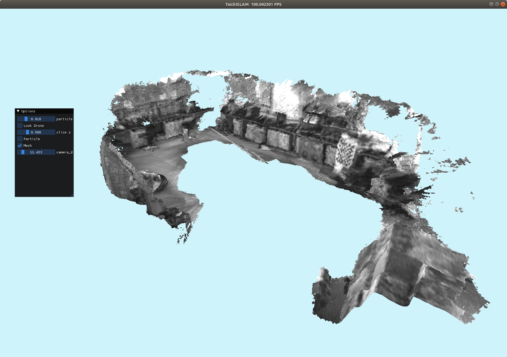
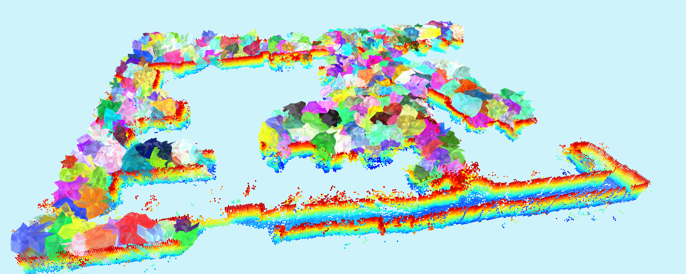
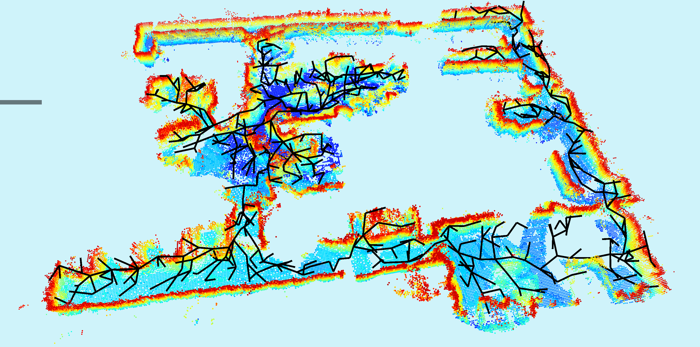
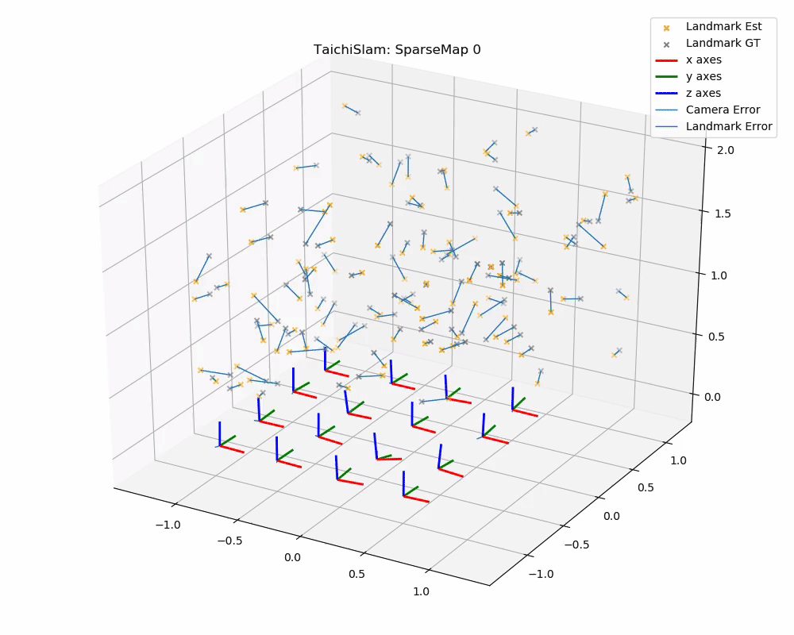

# TaichiSLAM
This project is a 3D Dense mapping backend library of SLAM based Taichi-Lang, designed for the aerial swarm.


[Demo video](https://www.bilibili.com/video/BV1yu41197Q4/)

## Intro
[Taichi](https://github.com/taichi-dev/taichi) is an efficient domain-specific language (DSL) designed for computer graphics (CG), which can be adopted for high-performance computing on mobile devices.
Thanks to the connection between CG and robotics, we can adopt this powerful tool to accelerate the development of robotics algorithms.

In this project, I am trying to take advantages of Taichi, including parallel optimization, sparse computing, advanced data structures and CUDA acceleration.
The original purpose of this project is to reproduce dense mapping papers, including [Octomap](https://octomap.github.io/), [Voxblox](https://github.com/ethz-asl/voxblox), [Voxgraph](https://github.com/ethz-asl/voxgraph) etc.

Note: This project is only backend of 3d dense mapping. For full SLAM features including real-time state estimation, pose graph optimization, depth generation, please take a look on [VINS](https://github.com/HKUST-Aerial-Robotics/VINS-Fisheye) and my fisheye fork of [VINS](https://github.com/xuhao1/VINS-Fisheye).

## Demos
Octomap/Occupy[1] map at different accuacy:


Truncated signed distance function (TSDF) [2]:
Surface reconstruct by TSDF (not refined)

Occupy map and slice of original TSDF

## Usage

Install taichi via pip
```bash
pip install taichi
```

Download TaichiSLAM to your dev folder and add them to PYTHONPATH

```
git clone https://github.com/xuhao1/TaichiSLAM
```

## Integration with ROS
Running TaichiSLAMNode (require ROS), download dataset at this [link](https://www.dropbox.com/s/7b4ltoap59bo44g/taichislam-realsense435.bag?dl=0).

```python
# Terminal 1
rosbag play taichislam-realsense435.bag
# Terminal 2
roslaunch launch/taichislam-d435.launch show:=true
```

## Generation topology skeleton graph [4]
This demo generate [topological skeleton graph](https://arxiv.org/abs/2208.04248) from TSDF
This demo does not require ROS. Nvidia GPU is recommend for better performance.

```
pip install -r requirements.txt
python tests/gen_topo_graph.py
```
This shows the polyhedron


De-select the mesh in the options to show the skeleton


## Bundle Adjustment (In development)



# Roadmap
## Paper Reproduction
- [x] Octomap
- [x] Voxblox
- [ ] Voxgraph

## Features
### Mapping
- [x] Octotree occupancy map [1]
- [x] TSDF [2]
- [x] Incremental ESDF [2]
- [x] Submap [3]
  - [ ] Octomap
  - [x] TSDF
  - [ ] ESDF
- [x] Topology skeleton graph generation [4]
  - [x] TSDF
  - [ ] Pointcloud/Octomap 
- [ ] Loop Detection

### MISC
- [x] ROS/RVIZ/rosbag interface
- [x] 3D occupancy map visuallizer
- [x] 3D TSDF/ESDF map visuallizer
- [ ] Export to C/C++
- [ ] Benchmark

# Know issue
Memory issue on ESDF generation, debugging...

# References
[1] Hornung, Armin, et al. "OctoMap: An efficient probabilistic 3D mapping framework based on octrees." Autonomous robots 34.3 (2013): 189-206.

[2] Oleynikova, Helen, et al. "Voxblox: Incremental 3d euclidean signed distance fields for on-board mav planning." 2017 IEEE/RSJ International Conference on Intelligent Robots and Systems (IROS). IEEE, 2017.

[3] Reijgwart, Victor, et al. "Voxgraph: Globally consistent, volumetric mapping using signed distance function submaps." IEEE Robotics and Automation Letters 5.1 (2019): 227-234.

[4] [Chen, Xinyi, et al. "Fast 3D Sparse Topological Skeleton Graph Generation for Mobile Robot Global Planning." arXiv preprint arXiv:2208.04248 (2022).](https://arxiv.org/abs/2208.04248)

# LICENSE
LGPL
